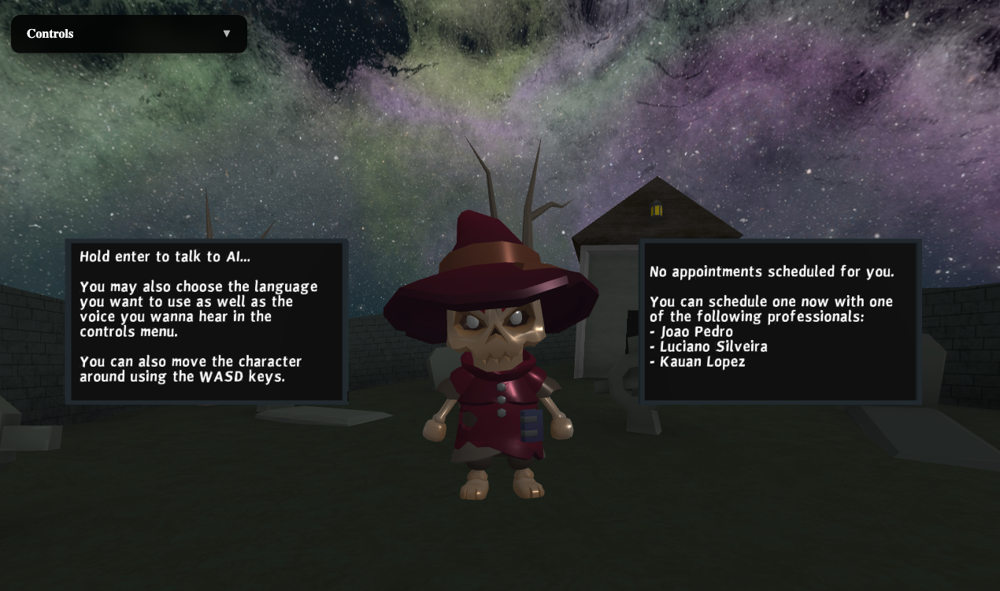
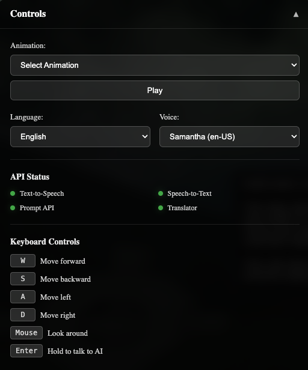

# Chrome AI APIs Demo - Trimly your 3D Virtual Assistant



> A proof of concept demonstrating the new Chrome AI APIs in a 3D environment.

## 🎯 Overview

This project showcases the integration of Chrome's new [built-in AI](https://developer.chrome.com/docs/ai/built-in) APIs in a 3D virtual environment. Using a combination of WebXR, A-Frame, and Chrome's experimental AI features, users can interact with a virtual assistant to schedule appointments with professionals in a 3D space.

🔴 **Note**: This is an experimental project and requires Chrome Canary with specific flags enabled.


⭐️ If you found this project interesting, please consider giving it a star!

*Note: This is an experimental project and may break or behave unexpectedly. Use at your own risk.*

[Live Demo](https://erickwendel.github.io/Trimly)

## ✨ Features

- 🎤 Voice interaction using Chrome's Speech-to-Text API
- 🗣️ Natural responses using Chrome's Text-to-Speech API
- 🤖 AI-powered conversations via Chrome's Prompt API
- 🌍 Multi-language support through Chrome's Translate API
- 🎮 Interactive 3D environment
- 📅 Simulated appointment scheduling system

## 💬 Available Commands

The AI assistant understands the following intents:
- **Check Availability**: Ask if a professional is available at a specific time
- **Schedule Appointment**: Confirm and book an available time slot
- **Cancel Appointment**: (Not implemented yet) Cancel an existing appointment
- **Check Appointments**: (Not implemented yet) List all scheduled appointments
- **Give Up**: (Partially implemented) Cancel the current conversation

### Example Conversations

```text
User: "Is Luciano available tomorrow at 2 PM?"
AI: "Yes, Luciano is available at that time. Would you like to schedule an appointment?"

User: "Yes, please!"
AI: "Great! I've scheduled your appointment with Luciano for tomorrow at 2 PM."

User: "Is Luciano available on March 20th at 11 AM?"
AI: "Let me check... Yes, that time slot is available. Should I book it for you?"
```

## 🛠️ Known Issues (where to contribute)

This is a proof of concept with several known issues:

- [ ] Occasional speech recognition delays
- [ ] Appointment confirmation flow needs improvement
- [ ] AI response parsing issues:
  - [ ] Sometimes fails to return valid JSON format, currently implements 3 retry attempts before failing
  - [ ] Need better prompt engineering for consistent responses
- [ ] Missing Features:
  - [ ] Cancel appointment functionality
  - [ ] Check appointments command
  - [ ] Proper conversation end when user says "no"
  - [ ] Multiple seats/concurrent appointments support
- [ ] Prompt Engineering:
  - [ ] Intent recognition needs improvement
  - [ ] Better handling of edge cases
  - [ ] More natural conversation flow
- [ ] 3d scene:
  - [ ] Physics for the character is not correct (not respecting the boundaries of the environment)
  - [ ] Not prepared for mobile devices - missing controls for touch screen
  - [ ] Animations are available, but are not being trigged when the user is interacting
  - [ ] Add animations for when the character is in idle state
  - [ ] Let the character fly in the space if reaches the border of the cemetery
  - [ ] Add support for AR on A-Frame
  
## 🚀 Getting Started

### Prerequisites

1. Install [Chrome Canary](https://www.google.com/chrome/canary/)
2. Enable the following flags in `chrome://flags`:
   - #experimental-web-platform-features
   - #enable-prompt-api
   - #enable-translate-api
   - #enable-speech-api
   - #enable-speech-synthesis-api

### Usage

1. Visit [the demo site](https://erickwendel.github.io/Trimly)
2. Select your preferred language from the dropdown
3. Hold the `Enter` key and ask about professional availability
   - Example: "Is Dr. Smith available tomorrow at 2 PM?"
4. If a time slot is available, hold `Enter` again and say "yes" to confirm

## 🎮 Controls



- `W` - Move forward
- `S` - Move backward
- `A` - Move left
- `D` - Move right
- `Mouse` - Look around
- `Enter` (hold) - Speak to AI assistant

## 🤝 Contributing

Contributions are very welcome! This project was created as a quick proof of concept, so there's plenty of room for improvement. Start by looking the [🛠️ Known Issues (where to contribute)](#%EF%B8%8F-known-issues-where-to-contribute)

## 🔧 Tech Stack

- A-Frame for 3D rendering
- Chrome AI APIs
  - Prompt API
  - Translate API
  - Speech-to-Text API
  - Text-to-Speech API
- JavaScript (ES6+)
- HTML5/CSS3

## 📝 License

This project is licensed under the MIT License - see the [LICENSE](LICENSE) file for details.

## 🙏 Acknowledgments

- Google Chrome team for the experimental AI APIs
- A-Frame community for the 3D web framework
- Contributors and issue reporters
- 3D Models
    - [Skeleton Mage](https://poly.pizza/m/kr72KKiunY) by [Kay Lousberg](https://poly.pizza/u/Kay%20Lousberg)

    - [Cemetery scene](https://poly.pizza/m/eauUqGZWR0O)  by Poly by [Google [CC-BY]](https://creativecommons.org/licenses/by/3.0/)
    - [Flat Screen](https://poly.pizza/m/cQ6pt8VHR7G) TV by [Alex Safayan](https://poly.pizza/u/Alex%20Safayan)
    - [Night Sky](https://ambientcg.com/view?id=NightSkyHDRI009)


---
